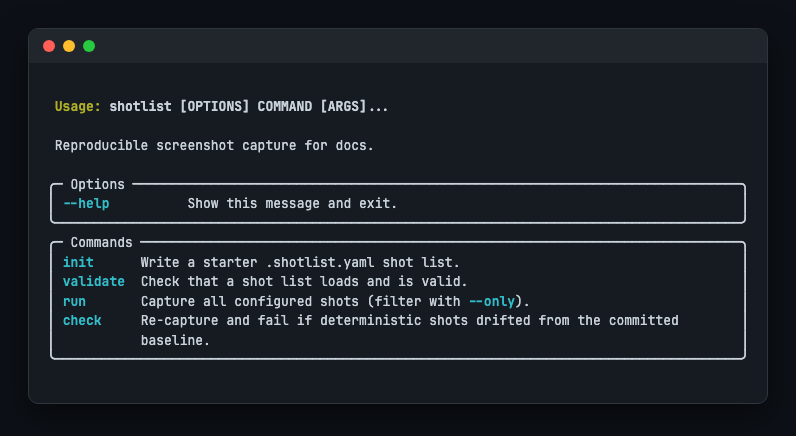
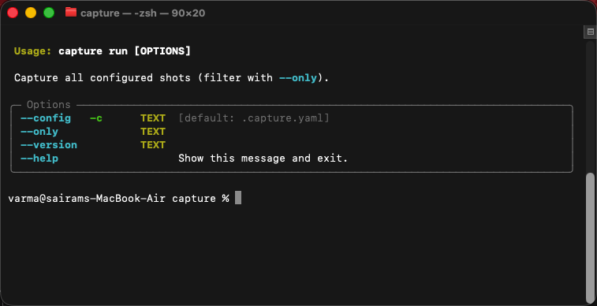

# shotlist

[](https://github.com/varmabudharaju/shotlist/actions/workflows/ci.yml)
[](https://github.com/varmabudharaju/shotlist/actions/workflows/verify-action.yml)
[](https://www.python.org/downloads/)
[](LICENSE)

**Screenshots for your docs — as code.** One committed shot list captures your
web pages, your *real* terminal windows, and stateful CLI sessions — and
regenerates them all with a single command.


## Contents

- [The problem](#the-problem)
- [Quickstart](#quickstart)
- [One shot list, four kinds of shot](#one-shot-list-four-kinds-of-shot)
- [Use cases](#use-cases)
- [Proof reports & pipelines](#proof-reports--pipelines)
- [Why shotlist, and not the others](#why-shotlist-and-not-the-others)
- [How it works](#how-it-works)
- [Use with Claude](#use-with-claude)
- [Commands](#commands)
- [Develop](#develop)

## The problem

Documenting a feature means launching the app, clicking to the right state,
screenshotting, naming the file, and embedding it — **every time the UI changes.**
The screenshots drift out of date the moment you ship, and nobody notices until
they're embarrassingly wrong.

`shotlist` makes them **reproducible**: describe *how to start your app* and *what
to shoot* once, in a committed `.shotlist.yaml`, then regenerate the whole set on
demand — locally or in CI. Same config + same app state → same screenshots.

## Quickstart

```bash
pip install shotlist             # installs the `shotlist` command
playwright install chromium      # one-time browser download

shotlist init        # writes a starter .shotlist.yaml
shotlist run         # boots your app, captures every shot, tears it all down
```

## One shot list, four kinds of shot

```yaml
output:
  dir: docs/screenshots
  readme: README.md            # optional: splice  snippets straight into the README

app:                           # optional — omit for static sites or pure-CLI shots
  command: "npm run dev"
  ready: { url: http://localhost:5173, timeout: 30 }   # never shoot a half-booted app

shots:
  - { name: dashboard, kind: web, url: http://localhost:5173/dashboard, full_page: true, alt: "Dashboard" }
  - { name: cli-help,  kind: cli, command: "mytool --help", alt: "Top-level help" }
```

| Kind | Captures | How |
| --- | --- | --- |
| **`web`** | a browser page — with optional click/fill/wait steps first | Playwright / Chromium |
| **`cli` · `native`** *(macOS default)* | a **real screenshot of your Terminal.app window** — your font, your theme | AppleScript + `screencapture` |
| **`cli` · `rendered`** *(any OS, CI-safe)* | the command's output drawn as a styled terminal card | PTY → ANSI→HTML → Chromium |
| **`session`** | a **stateful, multi-command flow** in one persistent terminal — one shot per step | one Terminal window, captured after each step |

A `session` is how you screenshot a flow whose later steps depend on earlier ones —
the shell state (cwd, env, background processes) carries across. Background a
long-running process with `&` and a small `wait_ms`, keep capturing, and the
session tears it down on close.

## Use cases

`shotlist` fits anywhere a screenshot would otherwise go stale:

- **README & docs screenshots** — the core: regenerate the whole set on every UI change.
- **Test-evidence / proof** — capture a feature flow step by step (a `session`) and share the generated `index.html` as proof it works.
- **CI drift-checking** — `shotlist check` fails the build when a screenshot changes unexpectedly (with a visual `--diff`).
- **Blog posts & tutorials** — polished web *and* CLI shots from one config.
- **Onboarding & demo galleries** — versioned sets you keep across releases.
- **Long-running processes** — background a dev server with `&` + `wait_ms` and shoot it live.

Each one has a complete, copy-paste `.shotlist.yaml` in the recipes cookbook,
**[`docs/recipes.md`](docs/recipes.md)**.

## Proof reports & pipelines

Every `shotlist run` also writes, next to the PNGs:

- **`index.html`** — a self-contained gallery you can open and share as a **proof report**;
- **`manifest.json`** — a machine-readable record of the run (a pipeline artifact).


Attach `manifest.json` to a CI job, or open `index.html` as test-evidence. Set
`output.title` to relabel the gallery heading, and `output.evidence` to also
splice a captioned Markdown test-evidence doc — its own file, distinct from
`output.dir` (where the PNGs land). Turn the report off with `--no-report`
(or `output.report: false`).

### Catch drift before your users do

Gate CI with **`shotlist check`** — it re-captures and fails when a screenshot
drifts from the committed baseline, telling you exactly *how much* moved:


Drift comes with receipts. `--diff DIR` renders a baseline·current·diff 3-up per
changed shot, plus a **`check-report.html`** that lists every shot with a status
badge — open it locally or grab it from the CI artifact the bundled **GitHub
Action** uploads (along with a step summary on the run page):


Bless intended changes with `shotlist check --update` (or `--update --only NAME`
for one shot), set `check.max_diff_pixel_ratio` to tolerate sub-pixel jitter, and
script against `check --json`. Details in **[`docs/pipeline.md`](docs/pipeline.md)**.

## Why shotlist, and not the others

The pieces exist in isolation; `shotlist` is the one tool that does all of it under
a single committed config.

| | web pages | real terminal | CLI sessions | README auto-embed | reproducible / CI |
| --- | :---: | :---: | :---: | :---: | :---: |
| **shotlist** | ✅ | ✅ | ✅ | ✅ | ✅ |
| shot-scraper | ✅ | ❌ | ❌ | ❌ | ✅ |
| freeze / carbon | ❌ | synthetic | ❌ | ❌ | ✅ |
| Percy / Chromatic | ✅ | ❌ | ❌ | ❌ | ✅ (cloud, paid) |
| doing it by hand | 😖 | 😖 | 😖 | ❌ | ❌ |

No cloud, no paid services, no special OS permissions for web/rendered shots.
(Native Terminal capture needs macOS Screen-Recording permission; everything else
needs nothing.)

## How it works

```
.shotlist.yaml ─► load + validate ─► [ boot app, wait until ready ] ─► one engine
                                                                        routes each
                                                                        shot by kind:
        web ───────► Playwright / Chromium
        cli·native ► a real Terminal.app window
        cli·render ► PTY → ANSI→HTML → Chromium
        session ───► one persistent Terminal, a shot per step
                                                                      ─► NN-name.png
                                                                         + README splice
```

The clever part is what *isn't* here: **no AI runs at capture time.** Claude's only
job is to *author* the `.shotlist.yaml` once by reading your repo; after that the
engine is a plain, deterministic program — fast, free, and re-runnable in CI with
no model in the loop. See the full design in [`docs/design.md`](docs/design.md).

**Robust by design.** The readiness probe (HTTP / TCP port / log line) means you
never screenshot a half-booted app, and the app is launched in its own process
group and torn down — even on a crash or Ctrl-C — so a shotlist run never leaves an
orphaned dev server behind.

**Deterministic by default.** Web shots can `mask` flaky regions (`mask:
[selector, ...]`) and always capture with CSS animations disabled; CLI shots can
`scrub` non-deterministic text (durations, timestamps, PIDs) with a regex before
rendering; and rendered CLI cards embed JetBrains Mono. Baselines now match
byte-for-byte across macOS and Linux CI, not just on the machine that made them.

## shotlist, captured by shotlist

This repo dogfoods itself: the shots below are produced by running `shotlist run`
on its own [`.shotlist.yaml`](.shotlist.yaml) and spliced in automatically.

<!-- shotlist:start -->
### The shotlist CLI



### Run options



<!-- shotlist:end -->

## Use with Claude

`shotlist` ships an optional Claude integration in [`integrations/claude/`](integrations/claude/):

- a **`/shotlist` skill** that inspects your repo (routes, `--help`, README), writes
  the `.shotlist.yaml` for you, and runs it;
- an optional **auto-snapshot hook** that drops a raw snapshot when a dev server
  starts (the honest "dumb snapshot"; the curated set always comes from `shotlist run`).

## Commands

| Command | What it does |
| --- | --- |
| `shotlist init` | Scaffold a starter `.shotlist.yaml` |
| `shotlist validate` | Check the shot list is well-formed |
| `shotlist run` | Capture every shot and write outputs |
| `shotlist run --only dashboard` | Capture a single shot by name |
| `shotlist run --version v2` | Write into a versioned subfolder |
| `shotlist check` | Fail if a screenshot drifted from the committed baseline |
| `shotlist check --update` | Re-shoot and accept the current screenshots as the baseline |
| `shotlist check --diff DIR` | Also render baseline·current·diff images for changed shots |
| `shotlist check --json` | Emit the drift report as JSON on stdout (human output moves to stderr) |
| `shotlist check --update --only NAME` | Re-bless just one shot in place (repeatable) |

## Develop

```bash
git clone https://github.com/varmabudharaju/shotlist && cd shotlist
python3 -m venv .venv && source .venv/bin/activate
pip install -e ".[dev]"
playwright install chromium
pytest                       # the suite is fully offline
```

CI runs ruff, mypy, and pytest — with an 85% coverage gate — on Ubuntu (Python
3.11, 3.12) and macOS (Python 3.12), so native Terminal capture stays covered
too. A separate **`verify-action`** workflow dogfoods the bundled GitHub Action
on every PR two ways: `verify-release` smoke-tests the shipped `@v0.3.1` action +
PyPI package, and `verify-source` runs the PR's own `action.yml` against its own
source (`package: -e .`) — so a regression in either is caught before it ships.
Releases publish to PyPI automatically via Trusted Publishing.

The hero GIF is itself reproducible — [`demo.tape`](demo.tape) + `vhs demo.tape`.

## License

MIT © Varma Budharaju
