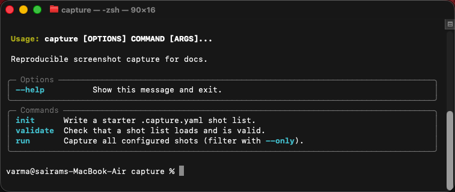

# capture

[](https://github.com/varmabudharaju/capture/actions/workflows/ci.yml)
[](https://www.python.org/downloads/)
[](LICENSE)

**Reproducible screenshot capture for docs.** Describe *how to start your app* and
*what to capture* once, in a committed shot list — then regenerate every README,
blog, or test-evidence screenshot with a single command.

See the full design in [`docs/design.md`](docs/design.md).

## See it in action

`capture` dogfoods itself — the shots below are produced by running `capture run` on this repo's own [`.capture.yaml`](.capture.yaml).

<!-- capture:start -->
### The capture CLI



### Run options


<!-- capture:end -->

## Why

Documenting features means launching the app, clicking to the right state, taking
a screenshot, naming it, and embedding it — every time the UI changes. `capture`
turns that into one reproducible step that works for **web apps** and **CLI tools**.

## How it works

A `.capture.yaml` in your repo declares the app and the shots:

```yaml
output:
  dir: docs/screenshots
  version: v1

app:
  command: "npm run dev"
  ready:
    url: http://localhost:5173
    timeout: 30

shots:
  - name: dashboard
    kind: web
    url: http://localhost:5173/dashboard
    full_page: true
    alt: "Dashboard with live stats"

  - name: search-help
    kind: cli
    command: "mytool search --help"
    alt: "search subcommand help"
```

```bash
capture run
```

`capture` boots the app, waits until it is actually ready, captures each shot,
tears everything down cleanly, and writes numbered PNGs plus ready-to-paste
`` snippets under `docs/screenshots/`.

**Web** shots are real Playwright/Chromium renders of the live page. **CLI** shots
are, by default on macOS, *real screenshots of your actual Terminal.app window*
(`style: native`) — your font, your theme, authentic. On other platforms (or with
`style: rendered`) the command output is drawn as a styled terminal card instead,
which needs no Screen-Recording permission and works in CI.

No macOS Screen-Recording permission, no external binaries, no cloud, no paid services.

## Install

```bash
git clone https://github.com/varmabudharaju/capture
cd capture
python3 -m venv .venv && source .venv/bin/activate
pip install -e ".[dev]"
playwright install chromium
```

## Commands

| Command | What it does |
| --- | --- |
| `capture init` | Scaffold a starter `.capture.yaml` |
| `capture validate` | Check the shot list is well-formed |
| `capture run` | Capture every shot and write outputs |
| `capture run --only dashboard` | Capture a single shot |

## License

MIT © Varma Budharaju
