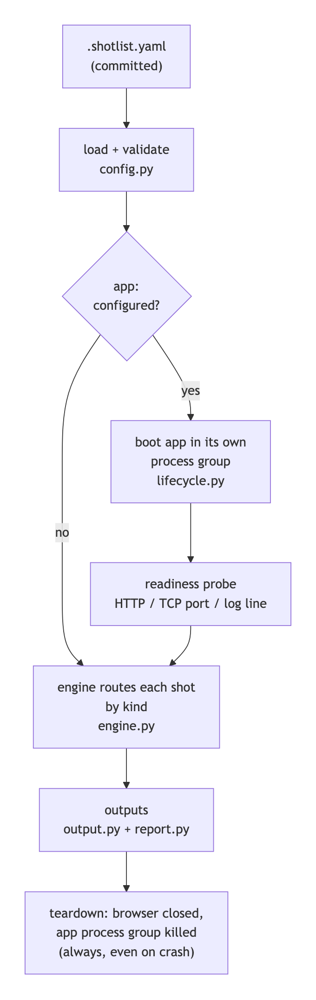
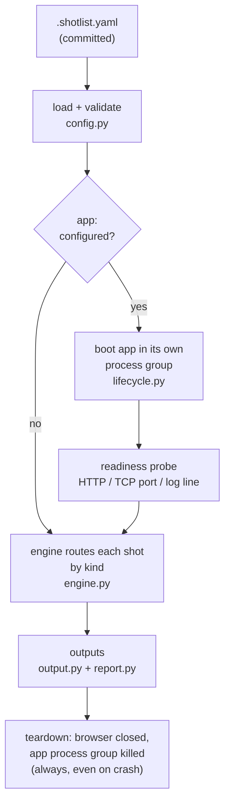
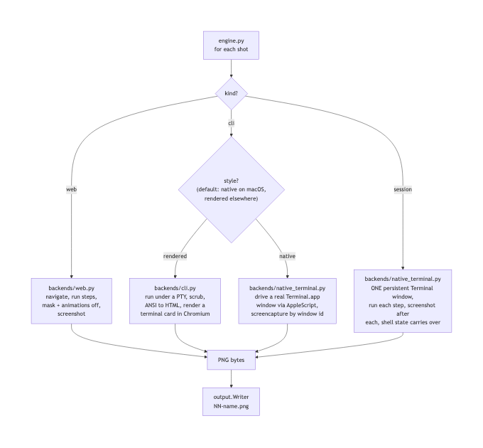
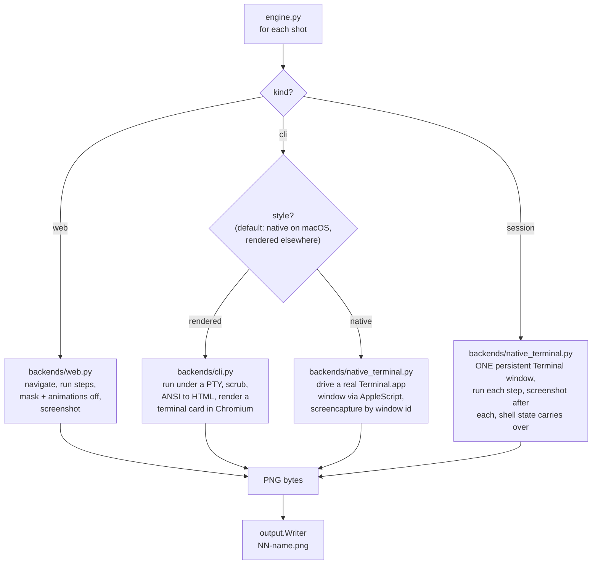
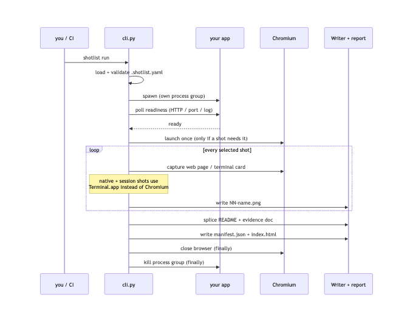
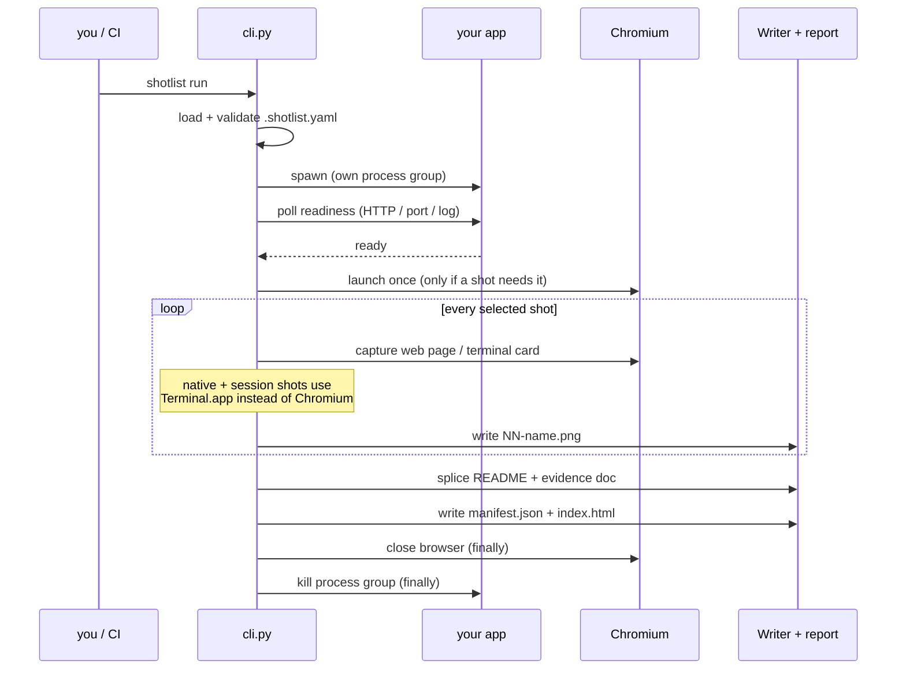
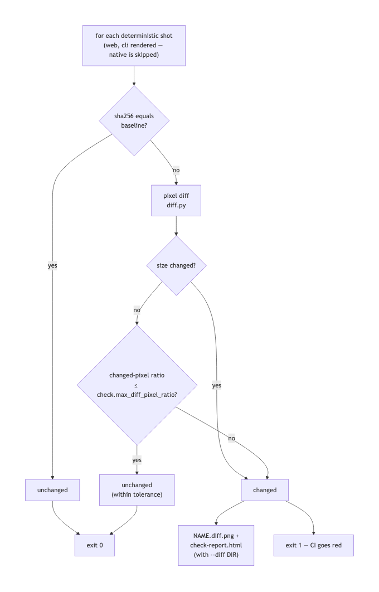
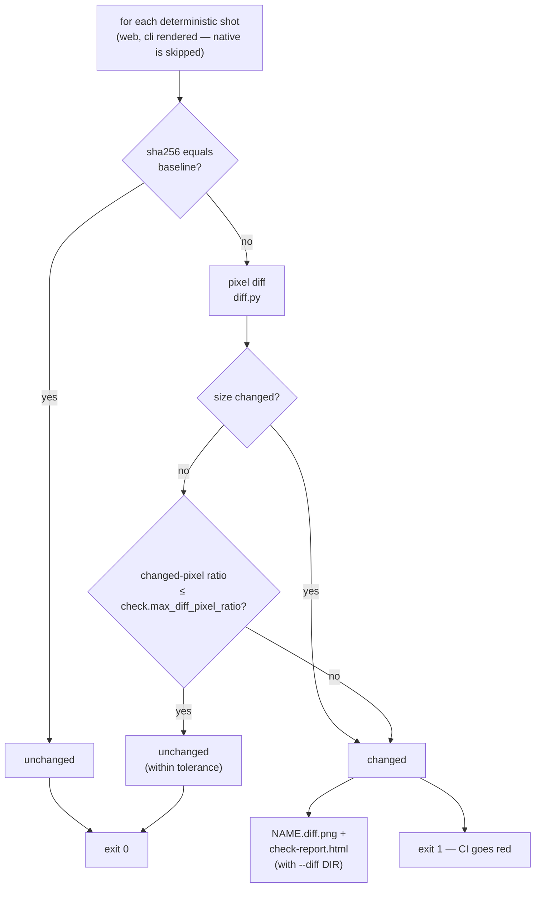
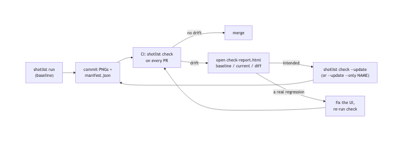
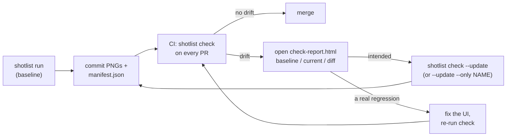

# How shotlist works

`shotlist` turns one committed YAML file into a reproducible screenshot set. This
page walks the whole machine end to end — what runs, in what order, and why the
same config keeps producing the same pixels. If you only remember one thing:
**there is no magic at capture time.** The engine is a plain, deterministic
program; every arrow below is ordinary code you can read in
[`src/shotlist/`](../src/shotlist/). Diagrams are committed PNGs (rendered from
the Mermaid source tucked under each one).

## The big picture

One run: load the config, boot your app (if any), wait until it is *actually*
ready, route every shot to the right backend, write numbered PNGs plus the run
artifacts, and tear everything down — even on failure.



<details>
<summary>Diagram source (Mermaid)</summary>



</details>

Three properties make this dependable:

- **Fail loudly, never half-shoot.** The readiness probe polls an HTTP URL, a TCP
  port, or a log line until your app answers — a half-booted app fails the run
  with the app's own output attached, instead of producing a blank screenshot.
- **No orphans.** The app runs in its own process group; `run` kills the whole
  group on exit, crash, or Ctrl-C. A shotlist run never leaves a dev server behind.
- **No AI in the loop.** Claude (optionally) *authors* the YAML once by reading
  your repo. After that, capture is a deterministic program you can re-run in CI
  forever, for free.

## One engine, four kinds of shot

The engine looks at each shot's `kind` (and, for CLI shots, its `style`) and
routes it to one of three backends. Chromium is launched once, and only if some
shot actually needs it.



<details>
<summary>Diagram source (Mermaid)</summary>



</details>

Why two CLI styles exist:

| | `rendered` | `native` |
| --- | --- | --- |
| What you get | a styled terminal *card* drawn by Chromium | a real screenshot of Terminal.app |
| Works on | any OS, headless CI | macOS with Screen-Recording permission |
| Reproducible byte-for-byte | **yes** — this is what `check` gates on | no (real windows never are) |

A `session` is the native backend running a *script* of commands in one window —
`cd`, environment variables, and backgrounded processes survive from step to
step, and every step yields its own numbered screenshot.

## What one `run` actually does

The same flow as a sequence — useful when you want to know *when* things happen
(and what gets cleaned up when something fails):



<details>
<summary>Diagram source (Mermaid)</summary>



</details>

## What lands on disk

Every run leaves a self-describing bundle next to your PNGs:

```text
docs/screenshots/
├── 01-dashboard.png          # numbered, slugified, stable order
├── 02-cli-help.png
├── index.html                # the proof report — a shareable gallery
└── manifest.json             # machine-readable record of the run
```

- `manifest.json` records, per shot: the file, its `sha256`, whether it is
  `deterministic`, and the `source` (URL or command) that produced it — plus a
  run-level `environment` block (shotlist / python / platform / playwright /
  chromium versions) and the `git_sha`. This is the baseline `check` compares
  against, and an audit trail for "where did this image come from?".
- `output.readme` splices `` snippets into your README between
  `<!-- shotlist:start/end -->` markers, idempotently.
- `output.evidence` writes a captioned Markdown test-evidence doc the same way.

## Drift checking — the `check` loop

`shotlist check` is the regression gate: re-capture the deterministic shots into
a temp directory (never touching your committed files) and compare against the
committed manifest. The comparison is cheap-first: an equal hash short-circuits;
only a hash mismatch pays for pixel decoding.



<details>
<summary>Diagram source (Mermaid)</summary>



</details>

And the human workflow around it:



<details>
<summary>Diagram source (Mermaid)</summary>



</details>

Two refinements keep this honest rather than noisy:

- **Tolerance.** `check.max_diff_pixel_ratio: 0.001` lets sub-pixel jitter pass
  while still reporting the measured drift; the default `0.0` is exact-match.
- **Environment warnings.** If the baseline was captured with a different
  Chromium/Playwright/OS than the machine checking, `check` says so
  (`drift may be environmental`) instead of letting you chase a phantom UI bug.

## Why the same config produces the same pixels

Determinism is layered — each layer removes one source of noise:

| Layer | Noise it removes |
| --- | --- |
| Readiness probe | half-booted apps, race-dependent first paints |
| Fixed viewport + full-page/element capture | window-size dependence |
| `animations: disabled` (always, for web shots) | mid-animation frames |
| `mask: [selector, ...]` | timestamps, avatars, live data in web pages |
| `scrub: [{pattern, replace}]` | durations, PIDs, paths in CLI output |
| Embedded JetBrains Mono in rendered cards | OS font-fallback differences — macOS and Linux CI produce **byte-identical** cards |
| PTY with pinned `TERM`/`COLUMNS` | color and wrapping differences between shells |

Native Terminal shots sit deliberately outside this stack: they are *authentic*
(your font, your theme) and therefore excluded from drift checking rather than
pretending to reproduce.

## Module map

| Module | Owns |
| --- | --- |
| [`config.py`](../src/shotlist/config.py) | the YAML schema — strict pydantic models, typo-rejecting |
| [`lifecycle.py`](../src/shotlist/lifecycle.py) | app boot, readiness probes, process-group teardown |
| [`engine.py`](../src/shotlist/engine.py) | orchestration: routing shots, one Chromium, guaranteed cleanup |
| [`backends/web.py`](../src/shotlist/backends/web.py) | Playwright navigation, steps, masking, screenshots |
| [`backends/cli.py`](../src/shotlist/backends/cli.py) | PTY execution, scrubbing, ANSI capture |
| [`render.py`](../src/shotlist/render.py) | the terminal-card HTML template + embedded font |
| [`backends/native_terminal.py`](../src/shotlist/backends/native_terminal.py) | real Terminal.app windows and persistent sessions |
| [`output.py`](../src/shotlist/output.py) | file naming, README/evidence splicing |
| [`report.py`](../src/shotlist/report.py) | `manifest.json`, `index.html`, environment stamping |
| [`check.py`](../src/shotlist/check.py) + [`diff.py`](../src/shotlist/diff.py) | drift comparison and visual diffs |
| [`cli.py`](../src/shotlist/cli.py) | the `init` / `validate` / `run` / `check` commands |

For the design rationale and the decisions behind these boundaries, see
[`design.md`](design.md); for CI usage and the GitHub Action, see
[`pipeline.md`](pipeline.md).
