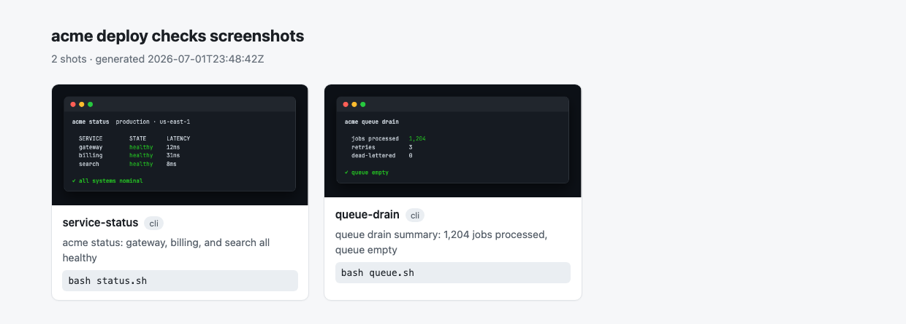
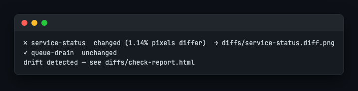
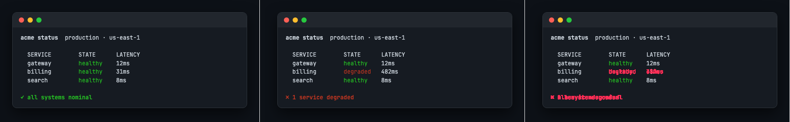
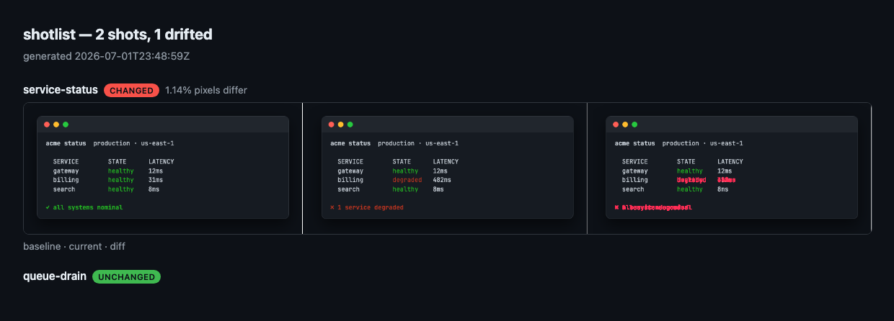

# Pipeline & proof reports

Every `shotlist run` writes two extra files into the output directory, right next
to the PNGs:

- **`index.html`** — a self-contained gallery (a *proof report*): open it in a
  browser, share it, or attach it to a test-case doc.
- **`manifest.json`** — a machine-readable record of the run, for pipelines.



Both reference the images by bare filename, so the output directory is portable —
copy `docs/screenshots/` anywhere and the gallery still renders.

## The manifest

```json
{
  "schema_version": "1",
  "generated_at": "2026-06-25T23:27:13Z",
  "config": ".shotlist.yaml",
  "shot_count": 2,
  "shots": [
    { "index": 1, "name": "cli-help", "kind": "cli", "alt": "capture top-level help",
      "file": "01-cli-help.png", "bytes": 35864,
      "sha256": "9f86d081884c7d659a2feaa0c55ad015a3bf4f1b2b0b822cd15d6c15b0f00a08",
      "deterministic": true, "source": "mytool --help" }
  ],
  "environment": {
    "shotlist": "0.3.0", "python": "3.12.3", "platform": "darwin",
    "playwright": "1.47.0", "chromium": "119.0.6045.9"
  },
  "git_sha": "a1b2c3d"
}
```

| Field | Meaning |
| --- | --- |
| `schema_version` | Manifest format version — bumped only on a breaking change. |
| `generated_at` | UTC timestamp of the run (ISO-8601). |
| `config` | The shot list the run used (the `--config` path). |
| `shot_count` | Number of images produced. |
| `shots[]` | Per image: `index`, `name`, `kind` (`web`/`cli`/`session`), `alt`, `file` (bare PNG filename), `bytes`, `sha256` (content hash), `deterministic` (whether the shot reproduces byte-for-byte across runs), and `source` (the URL or command that produced it). |
| `environment` | Versions that shape a capture: `shotlist`, `python`, `platform`, `playwright`, `chromium` (installed package versions plus the interpreter and OS; `chromium` is `null` when no browser was launched for the run). `check` compares this against the current machine — see [Environment warnings](#environment-warnings) below. |
| `git_sha` | Short commit SHA of the repo at capture time, or `null` when git is missing, the run is outside a repository, or the lookup otherwise fails. |

## Drift checking — `shotlist check`

`shotlist check` re-captures and **fails if anything drifted** from the committed
`manifest.json`, comparing each shot by its `sha256`. Run it on every PR and a
changed screen turns the build red.



- Only **deterministic** shots (`web`, `cli·rendered`) are compared; `native`
  Terminal screenshots can't reproduce byte-for-byte, so they're **skipped**.
- Checking is **non-destructive** — it captures into a temp dir and never touches
  your committed PNGs.
- Exit is **non-zero on drift** (changed / added / removed), zero when clean.

```bash
shotlist check                       # verify against the committed baseline
shotlist check --update              # re-shoot and accept the new screenshots
shotlist check --diff capture-diffs  # also render a visual diff of every change
```

Snapshot ergonomics: `check` to verify, `check --update` to bless an intended
change (like `jest -u`).

### Tolerance — `check.max_diff_pixel_ratio`

An identical `sha256` is an instant "unchanged" with no image decoding at all.
When the hash differs, that may still be noise — sub-pixel anti-aliasing, a
blinking cursor — rather than a real change. Set a tolerance budget and `check`
falls back to a pixel diff, counting drift only once the changed-pixel fraction
exceeds it:

```yaml
check:
  max_diff_pixel_ratio: 0.001   # up to 0.1% of pixels may differ before it's drift
```

Below the budget, the shot reports `unchanged` with the stats in the reason
(`within tolerance (0.02% <= 0.10%)`); above it, `changed` (`0.32% pixels
differ`). A size change (e.g. `1280x800 -> 1280x912`) always counts as drift,
tolerance or not. The default, `0.0`, keeps the historical exact-match behavior.

### Selective update — `--update --only NAME`

`--update` alone re-shoots and writes the *whole* baseline. `--update --only
NAME` (repeatable) re-blesses just the named shots in place instead:

```bash
shotlist check --update --only dashboard --only cli-help
```

It re-captures only those shots, overwrites their existing baseline PNG
(preserving its `NN-` file numbering), and rewrites just their `sha256`/`bytes`
plus the manifest's `generated_at`. Every other shot, and every top-level key
this command doesn't manage — including the `environment` block — is copied
through untouched. That's a deliberate trade-off: a selectively re-blessed shot
keeps its *old* `environment` stamp until you run a full `check --update`. Only
deterministic shots already in the baseline can be re-blessed this way; a
native/session shot, an unknown name, or a name missing from the baseline is a
clear error.

### JSON output — `--json`

```bash
shotlist check --json > report.json    # machine-readable; human lines go to stderr
```

```json
{
  "drifted": true,
  "environment_mismatch": ["chromium: 118.0.5993.70 -> 119.0.6045.9"],
  "shots": [
    {
      "name": "dashboard",
      "status": "changed",
      "reason": "0.32% pixels differ",
      "changed_pixel_ratio": 0.0032,
      "diff_file": "dashboard.diff.png"
    }
  ]
}
```

`diff_file` is present only when `--diff DIR` was also passed. With `--json`,
stdout carries only this document — every human-readable line (per-shot status,
environment warnings, the verdict) moves to stderr, so stdout stays parseable.

### Visual diffs

`--diff DIR` renders, for each changed shot, a 3-up image — **baseline · current ·
highlighted difference** — plus `check-report.html` (renamed from `diff.html`):
unlike the old gallery, it lists **every** shot, not only the failures, each with
a status badge and its reason; changed shots additionally show their diff image
inline.





### Environment warnings

Every baseline manifest carries an `environment` block (see [The
manifest](#the-manifest)). `check` compares it against the machine running the
check and, on any mismatch, prints a warning per differing key instead of
failing the shot itself:

```
⚠ environment: chromium 118.0.5993.70 -> 119.0.6045.9 (drift may be environmental)
```

`--json` carries the same information as `"key: old -> new"` strings under
`environment_mismatch`. A key missing or `null` on either side is skipped, so an
un-probed Chromium version never produces a spurious warning.

## In a pipeline

The manifest also makes a run scriptable — assert a count or attach it as a build
artifact:

```bash
shotlist run
test "$(jq .shot_count docs/screenshots/manifest.json)" -ge 5   # expect ≥ 5 shots
```

## GitHub Action

`shotlist` ships a composite action — drop it into a workflow to drift-check on
every push:

```yaml
# .github/workflows/screenshots.yml
name: screenshots
on: [push, pull_request]
jobs:
  capture:
    runs-on: ubuntu-latest
    steps:
      - uses: actions/checkout@v4
      - uses: actions/setup-python@v5
        with:
          python-version: "3.11"
      - uses: varmabudharaju/shotlist@v0.3.0      # `command` defaults to check
```

Pass `with: { command: run }` to regenerate instead, or
`with: { config: path/to/.shotlist.yaml }`. Bump the `@v0.3.0` tag when you upgrade.

Two more inputs beyond `command`/`config`:

| Input | Default | What it does |
| --- | --- | --- |
| `package` | `shotlist` | Passed to `pip install`; use `-e .` to exercise a checked-out source tree (e.g. a PR) instead of the published package. |
| `diff-dir` | `shotlist-diffs` | Directory `check --diff` writes into. |

On `check`, the action also renders a Markdown **step summary** — the result
line, any environment-mismatch bullets, and a shot/status/detail table built
from the `--json` report — and **uploads** `<diff-dir>` plus the raw JSON as a
`shotlist-check-<job>` build artifact, even when the check fails; the job still
exits with `check`'s own exit code afterward, so a real drift still turns the
build red.

See also [recipes #2](recipes.md#2-regenerate-docs-screenshots-in-ci).

## Turning it off

The report is on by default. Disable it per run or per repo:

```bash
shotlist run --no-report
```

```yaml
output:
  dir: docs/screenshots
  report: false
```
